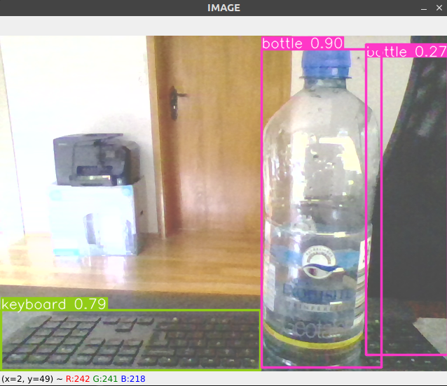

# Yolov5 Inference on Webcam
this project utilizes ros2 communication framework (publisher and subscriber) to enable inference of YOLOv5 on webcam.

## Build Docker images

build docker image for ros galactic
```python
docker build -f dockerfile_nvidia_ros_galactic -t ros_galactic .
```

build docker image for ros galactic with yolov5
```python
docker build -f dockerfile_yolov5_webcam -t yolov5_webcam
```

run docker container
```python
xhost +
docker run -it --net=host --gpus all \
        --device=/dev/video0:/dev/video0 \
        --env="NVIDIA_DRIVER_CAPABILITIES=all" \
        --env="DISPLAY" \
        --env="QT_X11_NO_MITSHM=1" \
        --volume="/tmp/.X11-unix:/tmp/.X11-unix:rw" \
        --volume="/home/leyong/projects/yolov5_webcam_object_detection/src:/persistent_storage:rw" \
        --name yolov5_webcam \
        yolov5_webcam bash
```
please change the volume path "/home/leyong/..." to your respective git repo path.

## Copy development files

copy file from host to docker workspace
```python
cp -R /persistent_storage/yolov5_webcam /yolov5_webcam_tutorial_ws/src
```

copy yolov5 utils and models to workspace
```python
cp -R /yolov5_webcam_tutorial_ws/src/yolov5/utils /yolov5_webcam_tutorial_ws/src/yolov5_webcam/scripts
cp -R /yolov5_webcam_tutorial_ws/src/yolov5/models /yolov5_webcam_tutorial_ws/src/yolov5_webcam/scripts
```

## Build ROS packages

```python
cd /yolov5_webcam_tutorial_ws
colcon build
```

source environment
```python
source install/setup.bash
```

## Run publisher and subscriber

run publisher
```python
ros2 run yolov5_webcam camera_publisher.py
```

run subscriber
```python
cd src/yolov5_webcam/scripts
python3 camera_subscriber.py
```

## Demo picture
here is a demo of the screenshot taken to demonstrate the object detection result.

